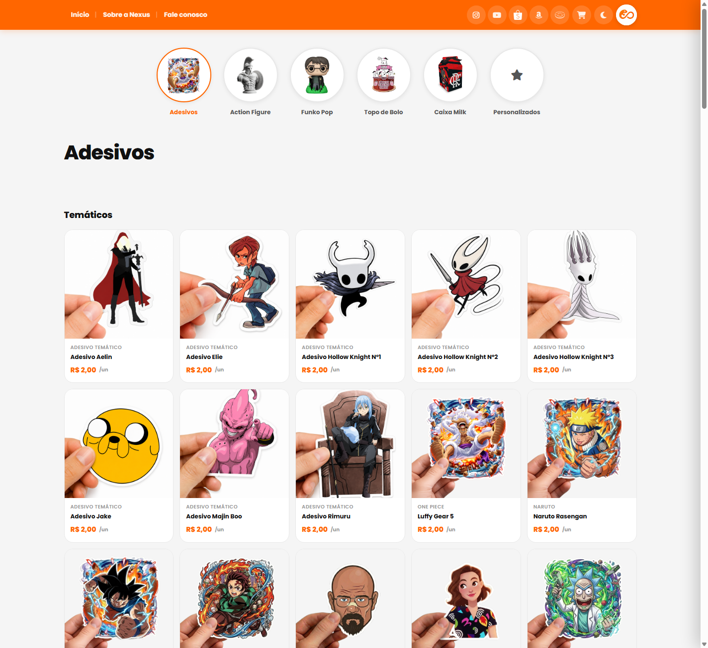
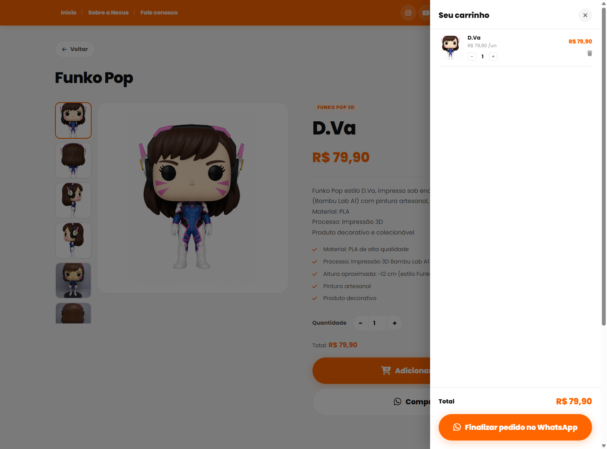
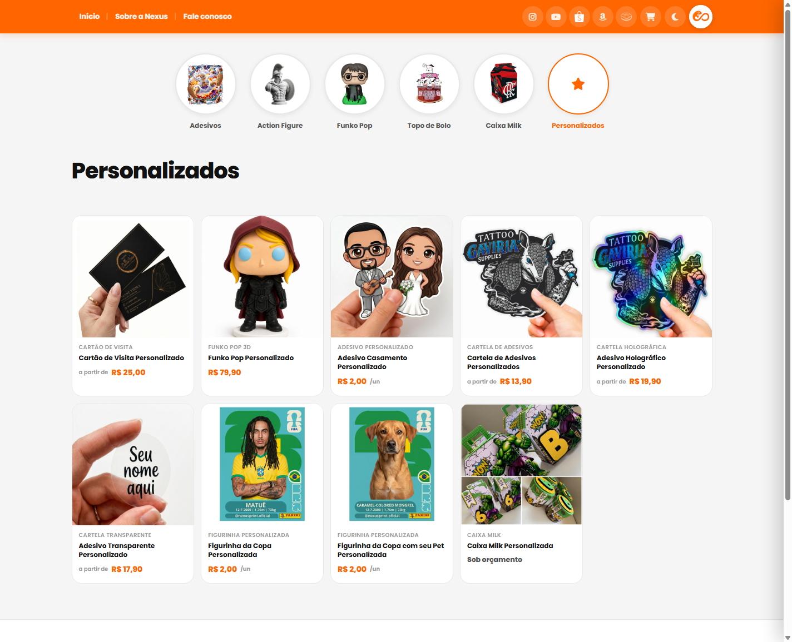
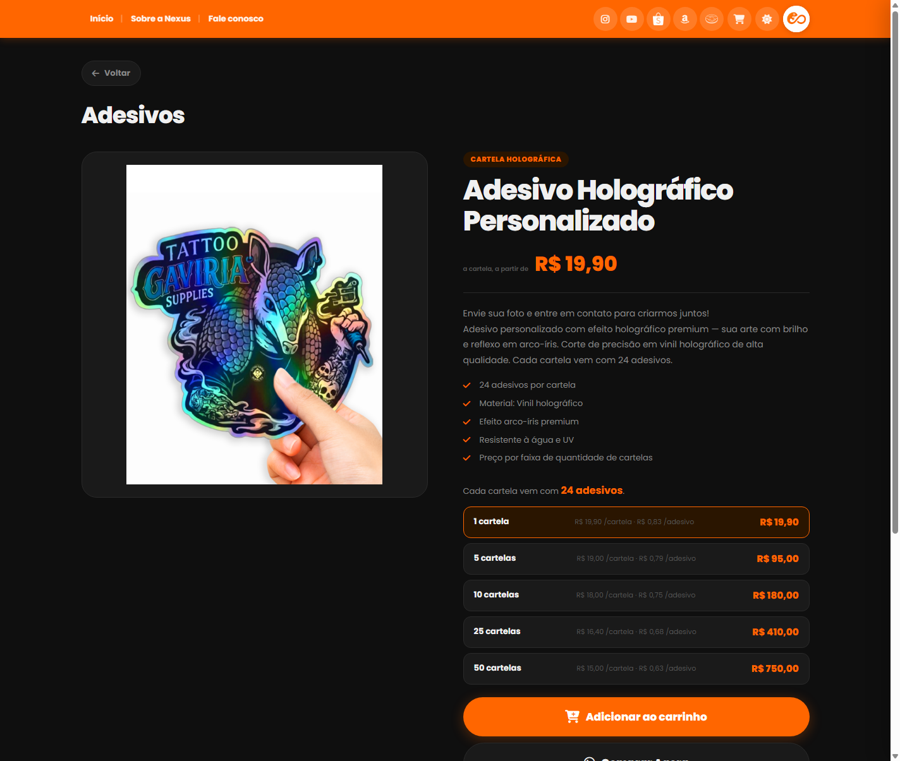
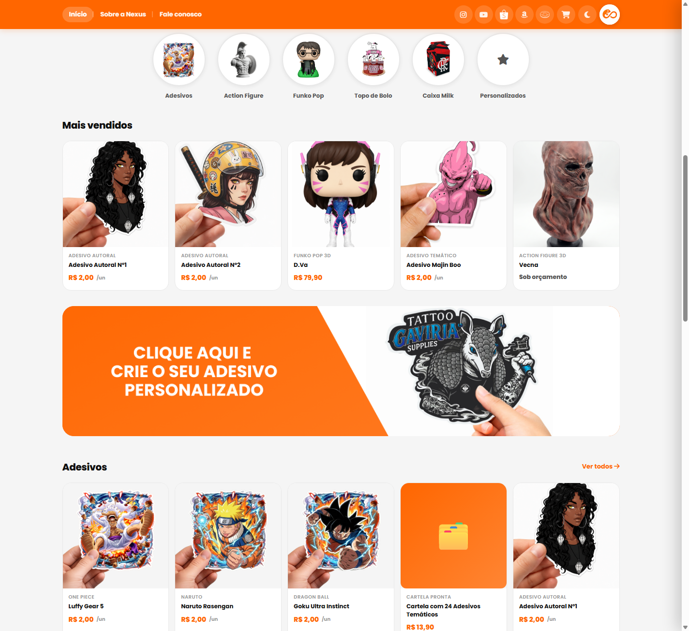

# Nexus Print

Loja virtual da **Nexus** — comunicação visual personalizada (adesivos, action figures, Funko Pop, topos de bolo, caixas milk, cartões de visita, figurinhas de álbum e produtos sob encomenda). Site estático, catálogo gerado a partir de fotos reais dos produtos, carrinho de compras e finalização de pedido direto no WhatsApp.

🔗 **Site no ar:** [erickkadr.github.io/NexusPrint](https://erickkadr.github.io/NexusPrint/)

---

## Prints

| Home | Categoria (Adesivos) |
|---|---|
|  |  |

| Produto com faixa de preço | Carrinho |
|---|---|
|  |  |

| Página Personalizados | Modo escuro |
|---|---|
|  |  |

<details>
<summary>Ver mais um print (home com prévia de categorias)</summary>



</details>

---

## Principais funcionalidades

- **Catálogo com fotos reais** — mais de 130 produtos em 6 categorias (Adesivos, Action Figures, Funko Pop, Topo de Bolo, Caixa Milk, Cartões de Visita), incluindo mais de 50 figurinhas de álbum agrupadas por tema (Animes, Blue Lock, One Piece, Personalizadas).
- **4 modelos de preço**, escolhidos por produto:
  - preço fixo por unidade (ex.: adesivo avulso R$ 2,00);
  - preço fixo total (ex.: topo de bolo);
  - **faixa de preço por quantidade**, com tabela de desconto progressivo (cartões de visita, cartelas de adesivo, caixinhas, tags) — incluindo o cálculo de preço por cartela *e* por adesivo individual;
  - **sob orçamento**, para peças 100% sob encomenda (action figures 3D).
- **Página "Personalizados"** — vitrine única com todos os produtos feitos sob encomenda (envie sua foto e a equipe entra em contato).
- **Carrinho de compras** persistente (localStorage), com contador animado, adicionar direto pelo card do produto ou pela página de detalhe, controle de quantidade e remoção de itens.
- **Checkout via WhatsApp** — o botão "Finalizar pedido" monta uma única mensagem com todos os itens do carrinho, quantidades e valores, e abre o WhatsApp da loja.
- **Página de produto com galeria dinâmica** — mostra só as fotos reais que o produto tem (1 a N), sem preencher espaço vazio com imagem genérica.
- **Modo claro/escuro** com preferência salva no navegador.
- **Totalmente responsivo**, sem dependência de framework front-end.

## Tecnologias

- **HTML5, CSS3 e JavaScript puro** (vanilla) — sem framework, sem build step.
- **Node.js** — usado apenas para o script de geração do catálogo (`scripts/gerar-produtos.js`), não é necessário para rodar o site.
- **Font Awesome 6** (ícones) e **Google Fonts — Poppins** via CDN.
- **GitHub Pages** para hospedagem/deploy.

## Estrutura do projeto

```
Site Nexus/
├── index.html            # Home
├── adesivos.html          action-figures.html
├── funko-pop.html          topo-de-bolo.html      → páginas de categoria
├── caixas-milk.html
├── personalizados.html    # Vitrine dos produtos sob encomenda
├── produto.html           # Página de detalhe (uma pra todos os produtos, via ?id=)
├── sobre.html             # Institucional
│
├── produtos.js            # Catálogo (dados) + helpers de renderização — GERADO, não editar à mão
├── cart.js                # Carrinho (localStorage) + checkout via WhatsApp
├── script.js               # Tema, galeria, navegação, boot de cada página
├── style.css               # Todo o CSS do site
│
├── images/
│   └── produtos/           # Fotos dos produtos, copiadas e organizadas por categoria
│
└── scripts/
    └── gerar-produtos.js   # Gera produtos.js a partir das fotos reais + tabela de preços
```

## Como rodar localmente

O site é 100% estático — não precisa de build nem de dependências instaladas.

```bash
# qualquer servidor estático simples serve, por exemplo:
npx serve .
# ou
python -m http.server 8080
```

Depois é só abrir `http://localhost:8080` no navegador.

## Atualizando o catálogo de produtos

O arquivo `produtos.js` **não deve ser editado manualmente** — ele é gerado automaticamente pelo script `scripts/gerar-produtos.js`, que:

1. Lê as fotos reais dos produtos de uma pasta de origem;
2. Copia e organiza essas imagens em `images/produtos/`;
3. Monta o catálogo completo (nome, categoria, preço, descrição, especificações) com base em uma tabela de preços;
4. Escreve tudo de novo em `produtos.js`.

Para atualizar o catálogo (nova foto, novo preço, novo produto), ajuste o script e rode:

```bash
node scripts/gerar-produtos.js
```

## Deploy

O site é publicado via **GitHub Pages**, direto da branch `main`. Qualquer alteração enviada (`git push`) para `main` fica no ar em poucos minutos.

> Se depois de um push o site parecer desatualizado, geralmente é cache do navegador — force um recarregamento (`Ctrl+Shift+R`) ou abra em uma aba anônima.

---

<p align="center">Nexus — Comunicação Visual</p>
